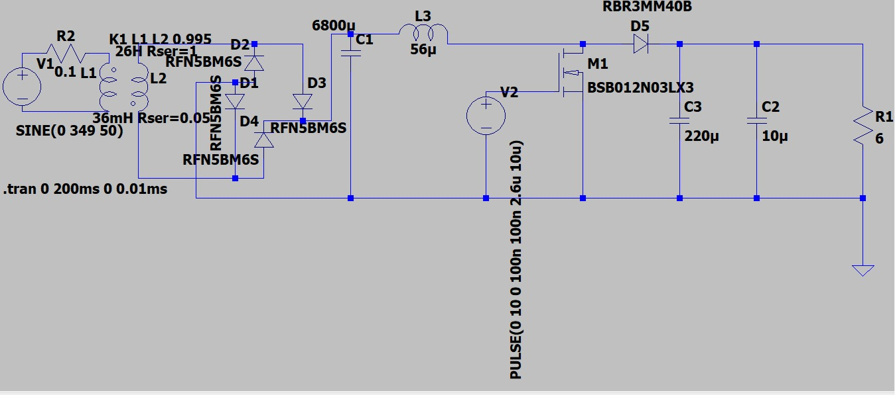

# DC-voltage-regulation-by-using-AC-supply-voltage-from-mains
Conversion of Domestic AC Mains to a Regulated 12 V DC Supply for Consumer Electronics Applications
Conversion of Domestic AC Mains to a Regulated 12 V DC Supply for Consumer Electronics Applications

Project Overview

This project demonstrates the complete design and simulation of an AC-DC power supply capable of converting domestic mains voltage into a regulated 12 V DC output suitable for powering consumer electronic devices.

## Circuit Diagram

The design combines traditional transformer-based isolation and rectification with a DC-DC boost conversion stage to achieve a stable output voltage under varying load conditions.

The entire system was designed and verified using LTSpice, with emphasis on component selection, power conversion principles, voltage regulation, ripple reduction, and practical non-ideal effects.

---

Design Objectives

- Convert domestic AC mains supply to regulated DC output.
- Provide electrical isolation between mains and load.
- Step down mains voltage to a safer low-voltage level.
- Rectify AC voltage into DC.
- Reduce ripple using capacitor filtering.
- Regulate output voltage using a switching converter.
- Deliver a stable 12 V output suitable for consumer electronics applications.

---

Target Specifications

Parameter| Value
Input Voltage| 247 V AC RMS
Input Frequency| 50 Hz
Output Voltage| 12 V DC
Output Current| 1.5 A
Output Power| 18 W
Simulation Platform| LTSpice

---

System Architecture

The power supply is divided into two major stages:

Stage 1: AC-DC Rectification and Voltage Step-Down

This stage converts the high-voltage AC mains into an unregulated low-voltage DC source.

Components:

- Mains Isolation Transformer
- Step-Down Transformer
- Bridge Rectifier
- Filter Capacitor

Functions:

- Provides galvanic isolation from the mains.
- Reduces mains voltage to a lower AC voltage.
- Converts AC voltage to pulsating DC.
- Smooths the rectified waveform to produce DC suitable for the next stage.

---

Stage 2: DC-DC Boost Converter

This stage regulates the filtered DC voltage and produces the final output voltage.

Components:

- Input Filter Capacitor Voltage Source
- Inductor
- PWM Source
- N-Channel MOSFET
- Schottky Diode
- Output Capacitor
- Load Resistor

Functions:

- Stores and transfers energy through the inductor.
- Uses high-frequency switching to regulate output voltage.
- Boosts and stabilizes the DC output.
- Minimizes output voltage ripple.
- Supplies power to the load.

---

Block Diagram

Domestic AC Mains (247 V AC)

↓

Isolation & Step-Down Transformer

↓

Bridge Rectifier

↓

Filter Capacitor

↓

Unregulated DC Bus

↓

Boost Converter

├── Inductor

├── PWM Generator

├── N-Channel MOSFET

├── Schottky Diode

└── Output Capacitor

↓

Regulated 12 V DC Output

↓

Consumer Electronic Load

---

Design Methodology

The design process was divided into the following stages:

1. Transformer Modeling and Turns Ratio Calculation
2. Magnetizing Inductance Selection
3. Bridge Rectifier Design
4. Filter Capacitor Sizing
5. Boost Converter Topology Selection
6. Inductor Design
7. PWM Duty Cycle Optimization
8. Output Capacitor Selection
9. Ripple Voltage Analysis
10. Load Regulation Verification
11. Current and Power Flow Analysis

---

Key Learning Outcomes

- Transformer modeling using coupled inductors.
- Practical implementation of AC-DC conversion.
- Full-wave bridge rectification.
- Capacitor filtering and ripple reduction.
- Boost converter operation and control.
- PWM-based voltage regulation.
- Analysis of inrush current and switching waveforms.
- Investigation of transformer current, capacitor current, and load current characteristics.
- Understanding of power flow from mains input to regulated DC output.

---

Future Improvements

- Efficiency optimization.
- Thermal analysis of semiconductor devices.
- Closed-loop feedback control.
- PCB implementation.
- EMI and EMC analysis.
- Hardware prototype development and testing.

Transformer Modeling

Objective

The transformer stage provides galvanic isolation from the AC mains and steps down the domestic supply voltage to a lower AC voltage suitable for rectification and regulation.

Design Specifications

Parameter| Value
Input Voltage| 247 V AC RMS
Output Voltage| 9 V AC RMS
Output Current| 2 A RMS
Frequency| 50 Hz

The input voltage was assumed to be 247 V RMS to account for practical variations in the distribution network.

---

Transformer Model

The transformer was modeled in LTSpice using two coupled inductors.

The relationship between transformer voltage ratio, turns ratio and inductance ratio is given by:

Vp/Vs = N1/N2

L1/L2 = (N1/N2)²

Where:

- Vp = Primary Voltage
- Vs = Secondary Voltage
- N1 = Primary Turns
- N2 = Secondary Turns
- L1 = Primary Inductance
- L2 = Secondary Inductance

---

Turns Ratio Calculation

Given:

Vp = 247 V

Vs = 9 V

Therefore,

N1/N2 = Vp/Vs

N1/N2 = 247/9

N1/N2 ≈ 27

Thus,

L1/L2 = 27²

L1/L2 = 729

---

Primary Inductance Calculation

The primary inductance was selected based on the desired magnetizing current under no-load conditions.

The inductance can be estimated using:

L1 = Vp / (2πfIm)

Where:

- Vp = 247 V
- f = 50 Hz
- Im = Magnetizing Current

The no-load magnetizing current was assumed to be approximately 30 mA, which falls within a practical range for a transformer of this size.

Substituting the values:

L1 = 247 / (2 × π × 50 × 0.03)

L1 ≈ 26 H

Therefore,

Primary Inductance (L1) = 26 H

---

Secondary Inductance Calculation

Using the inductance ratio:

L1/L2 = 729

Substituting L1 = 26 H:

26/L2 = 729

L2 = 26/729

L2 = 0.0356 H

L2 ≈ 36 mH

Therefore,

Secondary Inductance (L2) = 36 mH

---

Coupling Coefficient

The transformer coupling factor was chosen as:

K = 0.995

A coupling coefficient slightly less than unity introduces realistic leakage flux and magnetic losses that are present in practical transformers.

---

Winding Resistance Modeling

Real transformers are not ideal components. The copper windings possess finite resistance which causes:

- Copper losses (I²R losses)
- Voltage drop under load
- Reduced efficiency
- Heat generation

To account for these practical effects, winding resistance was included in the simulation model.

Selected Values

Winding| Resistance
Primary| 0.1 Ω
Secondary| 0.05 Ω

Justification

These values were selected as practical non-ideal winding resistances for simulation purposes.

The primary winding contains a larger number of turns and therefore a longer conductor length. Consequently, a slightly higher winding resistance was assigned.

The secondary winding contains fewer turns and a shorter conductor length, resulting in a lower winding resistance.

Including winding resistance provides:

- More realistic transformer behavior
- Improved load regulation analysis
- Representation of copper losses
- Prevention of unrealistic ideal transformer performance

The chosen values are approximations intended to model practical transformer behavior and can be refined further if measured winding resistance data becomes available.

---

Final Transformer Parameters

Parameter| Value
Primary Inductance (L1)| 26 H
Secondary Inductance (L2)| 36 mH
Coupling Coefficient| 0.995
Primary Resistance| 0.1 Ω
Secondary Resistance| 0.05 Ω
Input Voltage| 247 V AC RMS
Output Voltage| 9 V AC RMS
Output Current| 2 A RMS

The resulting transformer model was used as the front-end isolation and voltage step-down stage for the AC-DC converter simulation.

Rectification Stage

Objective

The transformer output is an AC waveform, whereas the subsequent stages of the power supply require a DC voltage source.

The purpose of the rectification stage is to convert the low-voltage AC output from the transformer into pulsating DC suitable for capacitor filtering and further voltage regulation.

---

Rectifier Topology

A full-wave bridge rectifier configuration was used.

The bridge rectifier consists of four diodes connected in a bridge arrangement.

This configuration enables both positive and negative half cycles of the AC waveform to contribute to the output, resulting in:

- Improved transformer utilization
- Higher average DC output voltage
- Reduced output ripple compared to half-wave rectification
- Better efficiency in power conversion

---

Diode Selection

Parameter| Value
Part Number| RFN5BM6S
Device Type| Silicon Rectifier Diode
Application| Full-Wave Bridge Rectifier

---

Operating Principle

A diode is a semiconductor device that permits current flow in the forward direction while blocking current flow in the reverse direction.

During each AC cycle:

- Two diodes conduct during the positive half cycle.
- The remaining two diodes conduct during the negative half cycle.

As a result, the load experiences current flow in a single direction for both halves of the AC waveform.

This process converts alternating current into pulsating direct current.

---

Forward Voltage Drop

Silicon rectifier diodes typically exhibit a forward voltage drop in the range:

0.8 V to 1.1 V

Since a bridge rectifier conducts through two diodes simultaneously during each half cycle, the total voltage drop becomes:

Vdrop = 2 × Vf

Assuming:

Vf ≈ 0.9 V

Total bridge voltage drop:

Vdrop ≈ 1.8 V

This voltage loss must be considered when estimating the DC voltage available after rectification.

---

Design Considerations

The selected diode must be capable of:

- Handling the secondary current of the transformer.
- Withstanding repetitive charging pulses from the filter capacitor.
- Tolerating reverse voltage stress during non-conducting intervals.
- Operating reliably at the intended load current.

The RFN5BM6S diode was selected to perform full-wave rectification while introducing realistic forward voltage losses into the simulation.

---

Output of the Rectification Stage

The bridge rectifier converts the transformer secondary AC voltage into pulsating DC.

This pulsating DC is subsequently filtered using a bulk capacitor to produce a smoother DC voltage for the boost converter stage.

Transformer Secondary AC

↓

Bridge Rectifier

↓

Pulsating DC

↓

Filter Capacitor

↓

Smoothed DC Bus

Capacitor Filter

Objective

The output of the bridge rectifier is a pulsating DC waveform containing ripple components. A bulk capacitor is placed across the rectifier output to store energy during voltage peaks and supply energy during voltage valleys, thereby reducing ripple before feeding the boost converter stage.

---

Capacitor Selection

The capacitance required to achieve a desired ripple voltage can be estimated using:

[
C = I_L/f_ripple×∆V
]

Where:

- C = Capacitance (F)
- I_L = Load Current (A)
- f_{ripple} = Ripple Frequency (Hz)
- \Delta V = Allowable Ripple Voltage (V)

For a full-wave bridge rectifier operating from a 50 Hz mains supply:

[
f_{ripple} = 2*50 = 100Hz
]

---

Initial Calculation

Assuming:

- Load Current = 2 A
- Ripple Frequency = 100 Hz
- Allowable Ripple Voltage = 0.5 V

[
C = 2/(100×0.5)
]

[
C = 0.04F
]

[
C = 40,000\mu F
]

This calculation indicates that approximately 40,000 µF would be required to limit the ripple voltage to 0.5 V.

---

Practical Design Consideration

The capacitor output is not directly connected to the load. Instead, it serves as the input source for a boost converter stage.

Since the boost converter provides voltage regulation and has sufficient headroom to compensate for moderate variations in input voltage, a larger ripple voltage can be tolerated at the capacitor output.

Allowing a ripple voltage of approximately 3 V significantly reduces the required capacitance while maintaining proper converter operation.

Assuming:

- Load Current = 2 A
- Ripple Frequency = 100 Hz
- Allowable Ripple Voltage = 3 V

[
C = 2/(100*3)
]

[
C = 0.00667F
]

[
C = 6,670 uF
]

The nearest standard capacitor value selected is:

[
C = 6,800 uF
]

---

Capacitor Voltage Rating

The rectified DC voltage across the capacitor remains below 12 V during normal operation.

To provide adequate design margin against startup transients, ripple voltage, and component tolerances, a voltage rating significantly higher than the operating voltage was selected.

Selected capacitor voltage rating:

[
V_{rating} = 25V
]

This provides sufficient safety margin while ensuring reliable operation.

---

Final Capacitor Selection

Parameter| Value
Capacitance| 6800 µF
Voltage Rating| 25 V
Ripple Frequency| 100 Hz
Allowable Ripple Voltage| 3 V
Application| Rectifier Output Filter Capacitor

The selected 6800 µF / 25 V capacitor provides adequate energy storage, reduces rectifier ripple, and supplies a stable input source for the boost converter stage while maintaining a practical component size.

Boost Converter Inductor Selection

Objective

The inductor is the primary energy storage element in a boost converter. During the MOSFET ON period, energy is stored in the magnetic field of the inductor. During the MOSFET OFF period, the stored energy is transferred to the output through the Schottky diode, resulting in a boosted output voltage.

Proper inductor selection is essential to control current ripple, maintain continuous conduction, and ensure stable converter operation.

---

Inductor Selection

The boost converter inductance can be estimated using:

[
L = Vin×D/(∆I_L*f_s)
]

Where:

- L = Inductance (H)
- V_{in} = Input Voltage (V)
- D = Duty Cycle
- ∆I_L = Inductor Current Ripple (A)
- f_s = Switching Frequency (Hz)

---

Design Parameters

Parameter| Value
Input Voltage (V_{in})| 11.4 V
Duty Cycle (D)| 0.073
Inductor Ripple Current (\Delta I_L)| 0.6 A
Switching Frequency (f_s)| 100 kHz

---

Inductance Calculation

Substituting the design parameters:

[
L = \frac{11.4 \times 0.073}{0.6 \times 100000}
]

[
L = 13.8\mu H
]

Therefore, the minimum calculated inductance required for the converter is:

[
L_{min} = 13.8\mu H
]

---

Practical Component Selection

In practical designs, a standard inductor value larger than the theoretical minimum is often selected to:

- Reduce inductor current ripple.
- Improve current stability.
- Minimize peak current stress on the MOSFET.
- Reduce output voltage ripple.
- Improve converter robustness under varying load conditions.

Based on these considerations, a standard value of:

[
L = 56\mu H
]

was selected.

The chosen inductance is approximately four times the minimum calculated value, providing additional ripple reduction and stable operation while remaining suitable for the selected switching frequency.

---

Final Inductor Selection

Parameter| Value
Calculated Inductance| 13.8 µH
Selected Inductance| 56 µH
Switching Frequency| 100 kHz
Application| Boost Converter Energy Storage Element

The selected 56 µH inductor provides adequate energy storage, reduced current ripple, and reliable operation for the 12 V DC output power stage.
